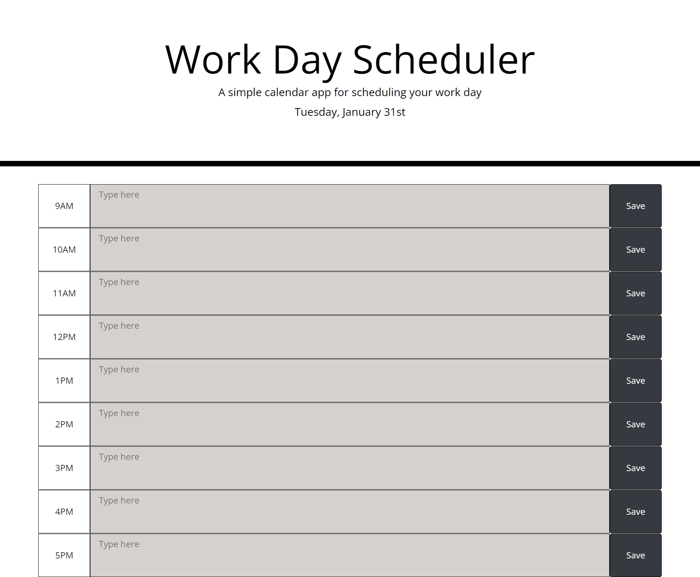

# my-work-day-scheduler

## Description
My work scheduler is a browser app that allows user to schedule and keep track of acivities during normal business hours, built with HTML, CSS and JavaScript (including Jquery and moment.js APIs).

## App screen shot 

## Usage Instruction/Features
Follow the app [App URL](https://eugieno.github.io/my-work-day-scheduler/), and you will land on the page pictured above. The app has a series a time blocks spanning a normal business hour of 9AM to 5PM. Each block has a text field which allows you to write activities you want to track. Activities written in the textfield can then be logged unto your local storage for future reference by clicking the save button. 

During active business hours, a red color code on the time block indicates current hour, a grey color indicates previous or past hours. Meanwhile, green color coded blocks indicates future hours. 

## Reflection 
This project was completed at the end of my 7th week at University of Birmingham bootcamp in FE web dev. 

The main project goals was to apply the knowledge gained working with third party web APIs like Jquery and moment.js. 

I did struggle initially implementing the color code logic, which meant I had to spend some time researching jQuery and moment.js documentations and other useful information I can find from other online sources. 

At the end, the technology I implemented in this project, include; HTML, CSS, JS, Jquery and moment.js APIs. 

## Upcoming (New) Features
In the immediate future, I plan to include the following features to extend the functonality and UI/UX of this web App.

1. A button which clears the local storage ('on-click') of each field from the UI. 
2. CSS styles - to get a more elegant and attractive design

